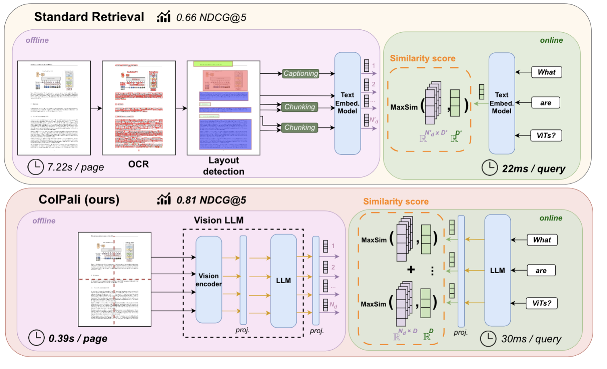

<div align='center'>
    
    <h1>Colpali-Insights</h1>
</div>

<div align="center">
  <h3>📚 对于开源项目Copali的个人理解</h3>
  <p><em>实践colpali的个人过程，希望能够帮助一些需要帮助的人</em></p>
</div>

---

## 🎯 项目介绍

> &emsp;&emsp;对于我看完 illuin-tech/colpali 开源项目： [colpali](https://github.com/illuin-tech/colpali) 后，我个人做了一些实验，想要写下个人的操作过程，一是为了留下自己的记录；二是如果有人遇到阻碍，希望能通过我的步骤解决成功，开心的跑通代码。更多想要了解的可以去官网进行详细的查看，这里只是将个人的经理进行说明。


## 📖 内容导航
- ColPali: Efficient Document Retrieval with Vision Language Models


    **ColPali ：利用视觉语言模型进行高效文档检索**

文献地址：https://arxiv.org/abs/2407.01449 

huggingface地址：https://huggingface.co/vidore/colpali


### 👀 文献解读
&emsp;&emsp;对于这篇文献，我自己也进行了阅读，制作成了 DPF进行查看，PDF 在 Docs 文件夹中，如果有写的不对的地方，欢迎大家们指正。

### ✨ 操作流程
&emsp;&emsp;我是按照官方的操作来的，安装的配置。这里只是写的详细一些。我使用的是 `Vscode`,在远程了连接的服务器,Linux 系统进行的操作，但是在这个项目里面本地其实和 Linux 的操作相差不大。


### 1.使用 conda 创建虚拟环境。
- &emsp;&emsp;如果没有 conda 建议安装一个，或者安装一个 miniconda3在本地，这个在网站上搜索都有，安装好后打开 Vscode ,安装对应的 python 插件就能玩了。

```bash
这个是我在远程服务器上安装 miniconda3 的操作步骤
mkdir -p ~/miniconda3
wget https://repo.anaconda.com/miniconda/Miniconda3-latest-Linux-x86_64.sh -O ~/miniconda3/miniconda.sh
bash ~/miniconda3/miniconda.sh -b -u -p ~/miniconda3
rm -rf ~/miniconda3/miniconda.sh

~/miniconda3/bin/conda init bash
~/miniconda3/bin/conda init zsh    (选择一种即可)
source ~/.bashrc  # 对于 bash
source ~/.zshrc   # 对于 zsh   或者重启终端


conda --version   # 查看一下 conda 是否安装成功

注意： 对于 `wegt` 这一步, 对于不同的架构安装不同的安装包，上面的适应  x86_64 架构（Intel/AMD CPU）

wget https://repo.anaconda.com/miniconda/Miniconda3-latest-Linux-aarch64.sh -O ~/miniconda3/miniconda.sh    这个是 ARM 架构（例如 Kunpeng、Apple M 系列、或某些国产 CPU）
通过 uname -m   来确定型号
后面的步骤都一致

```

&emsp;&emsp;安装好 conda 后，我建议是做不同的项目来创建不同的虚拟环境，避免一些安装依赖项的冲突导致运行错误。主要是通过 `conda` 或者 `uv` 来创建，对 `uv` 感兴趣的小伙伴可以去搜索教程去试试，的确会很快。
```bash
conda create --name py3116_cu118_t240_colpali python=3.11.6    # 创建虚拟环境
conda activate py3116_cu118_t240_colpali  # 激活
```

### 2.安装 colpali 的相应的配置

- 关于清华的镜像源
我们也可以添加一些国内的镜像，使得 pip 安装时,速度会比较快
```
conda config --add channels https://mirrors.tuna.tsinghua.edu.cn/anaconda/pkgs/free/
conda config --add channels https://mirrors.tuna.tsinghua.edu.cn/anaconda/pkgs/main/
conda config --add channels https://mirrors.tuna.tsinghua.edu.cn/anaconda/cloud/conda-forge/
conda config --set show_channel_urls yes
conda config --show channels   # 查看配置的源

# 镜像的移除操作
conda config --remove channels https://mirrors.tuna.tsinghua.edu.cn/anaconda/pkgs/free/

# 查看当前的镜像
conda config --show channels

```


```bash
pip install colpali-engine    # from PyPi
pip install git+https://github.com/illuin-tech/colpali

对于第二步，如果由于网络问题比较慢，可以使用镜像， https://ghfast.top/https://github.com/illuin-tech/colpali  将上面的地址进行切换即可

```

- 关于 git,如果显示出没有 git ,进行安装
```bash
sudo apt update      
sudo apt install git        
git --version

```


### 3.查看安装是否成功
一般来说，上述的操作，尤其是上面安装两条没有报错的话，是成功的。
```bash
pip show colpali-engine   # 查看它的版本
pip check            # 查看是否有安装依赖冲突，这通常对于 CUDA、torch 等会出现这个问题
```
<div align='center'>
    
</div>

- &emsp;&emsp;如果以上的问题都已解决，那么恭喜你，你已经成功的搭建起来了，可以去遨游跑代码去了！🤗

### 对于 Usage
&emsp;&emsp;对于官方下面给的很多个 demo 代码，我就不多说明了，大家都可以去跑一下，看看效果，我只想说明，对于代码里面的 `model_name` 虽然说有的代码，会自动的在 huggingface 上下载，但是通常会出现连接错误的情况，所以一般我是先把模型下载下来，然后把模型的地址改成自己的地址。


### 模型下载

| 模型名称 | 下载地址 |
| --- | --- |
| colqwen2-v1.0 | [🤖 HuggingFace](https://huggingface.co/vidore/colqwen2-v1.0) |
| colpali-v1.2 | [🤖 HuggingFace](https://huggingface.co/vidore/colpali-v1.2) |

- 对于 `huggingface` 的下载方式：
```bash
pip install huggingface_hub
export HF_ENDPOINT=https://hf-mirror.com
huggingface-cli download vidore/colqwen2-v1.0 --local-dir huggingface/models/vidore/colqwen2-v1.0      
# 后面是我指定模型文件放入指定的文件夹，自行修改
```
- 也可以使用 `modelscope` 方式进行下载(避免科学上网的网速问题)：
```bash
pip install modelscope
modelscope download --model vidore/colqwen2-v1.0 --local_dir huggingface/models/vidore/colqwen2-v1.0
```
&emsp;&emsp;对于这种方式下载，还有数据集下载，下载单个文件等指令，有兴趣的伙伴可以去搜索，或者有很多需要的话，我会再写一个文档在里面。

### Docs描述
&emsp;&emsp;这里面有我运行官方的部分代码，可以进行查看进行对比，发现自己是哪里出了问题;并且有我对于代码的一些改进，有需要的可以看看。


## 🤝 如何贡献

我们欢迎任何形式的贡献！

- 🐛 **报告 Bug** - 发现问题请提交 Issue
- 💡 **功能建议** - 有好想法就告诉我们
- 📝 **内容完善** - 帮助改进教程内容
- 🔧 **代码优化** - 提交 Pull Request


<div align="center">
  <p>⭐ 如果这个项目对你有帮助，请给我一个 Star！第一次写文档，如果有不对的地方，欢迎大家指正！</p>
</div>


---
